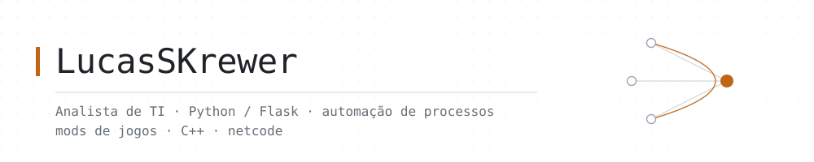

<picture>
  <source media="(prefers-color-scheme: dark)" srcset="assets/banner-a-dark.svg">
  <source media="(prefers-color-scheme: light)" srcset="assets/banner-a-light.svg">
  
</picture>

Analista de TI em uma indústria metalúrgica, onde toco a área sozinho — infraestrutura,
suporte e, a parte que mais gosto, **construir os sistemas internos que a empresa usa todo dia**.

Meu trabalho quase sempre começa igual: alguém perdendo horas numa planilha.
E termina com uma ferramenta web que faz aquilo em segundos.

Fora do expediente, mods de jogos — que é onde eu encosto em C++, engenharia reversa
e netcode.

### Stack do dia a dia

- **Python** — Flask, SQLite, pandas, automação de rotinas
- **Web** — HTML/CSS/JS sem framework, renderização server-side
- **Windows** — PowerShell, Waitress, deploy em servidor local
- **Dados** — conciliação fiscal e financeira, XML de NF-e, ETL de planilhas

### Projetos públicos

**[conciliador_nfe](https://github.com/LucasSKrewer/conciliador_nfe)** — compara a planilha
de NF-e da SEFAZ com o que foi lançado no sistema interno e mostra exatamente o que falta.
Flask + SQLite, roda local.

**[jlpt-estudos](https://github.com/LucasSKrewer/jlpt-estudos)** — sistema de estudo de
vocabulário japonês (JLPT N5 e N4), com roadmap progressivo por tópico e progresso por palavra.

A maior parte do que escrevo é interno e não sai da empresa. O que está aqui é a fatia que dá pra abrir.

### Mods de jogos

Modding me dá o tipo de problema que o trabalho não dá: código de outra pessoa, sem
documentação, sem o fonte do jogo, e um compilador de 2010 como requisito.

**[KenshiCoop](https://github.com/LucasSKrewer/KenshiCoop/blob/experimento-3-jogadores/FORK-NOTES.md)**
— fork experimental. O mod original é do [nhoral](https://github.com/nhoral/KenshiCoop)
(AGPL-3.0) e leva o Kenshi de single-player para co-op de dois jogadores; todo o crédito
pelo mod é dele.

Eu quis saber se a arquitetura de sincronização aguentava um grupo maior — uma direção
que o autor deliberadamente não segue, então virou fork em vez de issue. Na branch
[`experimento-3-jogadores`](https://github.com/LucasSKrewer/KenshiCoop/tree/experimento-3-jogadores):

- **Relay entre peers** — o host passa a repassar estado autorado por um peer aos
  *outros* peers, em um único ponto de estrangulamento, com política explícita por tipo
  de pacote e 42 asserções travando a tabela. No-op com dois jogadores.
- **Limpeza de estado por peer** — a saída de um jogador varria a sessão inteira,
  derrubando os proxies de quem ficou. Agora cada peer é varrido individualmente.
- **Guarda de sequência por remetente** — este é bug de verdade, não mudança de N: a
  documentação promete `seq` monotônico *por remetente*, mas a linha guardava um escalar
  só. Dois remetentes com contadores independentes se matavam de fome mutuamente.

Ainda não é N-ready, e o [FORK-NOTES](https://github.com/LucasSKrewer/KenshiCoop/blob/experimento-3-jogadores/FORK-NOTES.md)
lista honestamente o que falta.
